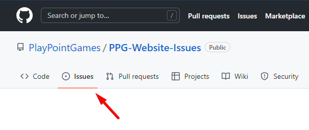

# PlayPointGames.com website issues

Report any bugs, issues and problems you find at PlayPointGames.com.
Rewards for reporting issues are as follows:

- 1 Point for typos, missing texts, faulty links, etc.
- 2-20 Points for bugs (show that a feature is broken or something does not work as expected)
- 21-2000 Points for security issues (demonstrate a way to get access to stuff you probably should not see)

# Reporting an issue

Create an issue by clicking "Issues" on the top left corner of this page. Make the description as short and on the point as possible. Always provide the page URL where the problem happens. You should also provide more information upon request if you wish to collect the possible reward.

# Rewards

Note! In order to claim the reward you must have a PPG account. A reward is paid only once per issue (except in cases where the problem re-appears after a fix). The severity is assessed on case by case basis by PPG admins and the reward is based on their sole discretion. We have the right to publish the usernames of reward winners on our website, Discord and social media accounts.
